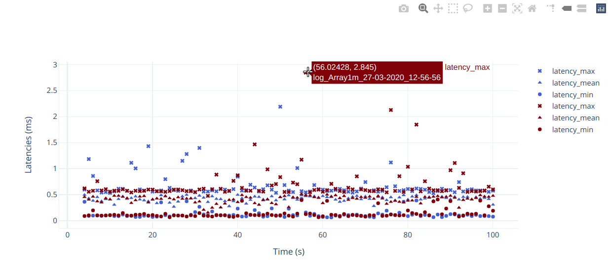

# Plot results

This plotter package includes two tools to plot the generated results:

1. Results rendered on a PDF file: handy to share results
    
1. Results rendered in a Jupyter notebook: used to compare multiple experiments
    

## Installation

On an Ubuntu system, install the following python3 and texlive packages:

```shell
sudo apt-get update
sudo apt-get install python3 python3-pip texlive texlive-pictures texlive-luatex texlive-latex-extra
```

Start a Python virtual environment:

```shell
cd plotter
python3 -m venv venv
source venv/bin/activate
```

 Install the required Python packages in that virtual environment:

```shell
pip3 install wheel
pip3 install .
```

## Usage

To generate a PDF from the log file, invoke the `perfplot` binary installed in the previous step:

```shell
perfplot <filename1> <filename2> ...

# When you are finished, deactivate the venv
deactivate
```

The PDF is created in the same directory as the log file.

Be sure to also check `perfplot -h` for additional options.

>>>
:point_up: **Common Pitfalls**

All of the latency metrics are collected and calculated by the subscriber process.
For interprocess communication, it is recommended to provide different suffixes for
the log files:

```shell
perf_test -c rclcpp-single-threaded-executor --msg Array1k -p 0 -s 1 -l log_sub.csv
perf_test -c rclcpp-single-threaded-executor --msg Array1k -p 1 -s 0 -l log_pub.csv
```

Then, to plot the latency metrics, invoke perfplot on the subscriber's log file.
If perfplot is invoked on the publisher's log file, then the CPU and memory
metrics will be plotted, but the latency plot will be empty.
>>>

## Jupyter notebook

For users familiar with Python, `plot_logs.ipynb` includes an example to
plot and compare multiple results simultaneously.
